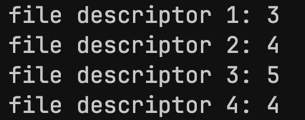

# C-Socket-Programming Lab 2


## Protocols, Socket Creation, Data Transmission

---

### Protocols
Network protocols are formal standards and policies used for communication between two or more devices over a network.

Protocols are divided into two categories:

- Transport protocols (TCP, UDP)
- Application protocols (HTTP, FTP)

---

### Sockets

In Linux, sockets are essentially <strong>file descriptors</strong> (numbers representing unique streams). They are used to send data between processes.

<br>

##### Socket Creation:
```C
// returns a socket descriptor
int socket(int domain, int type, int protocol);
```


##### Socket types:

- `SOCK_STREAM` - TCP (Transport Control Protocol, connection-oriented, stable)
- `SOCK_DGRAM` - UDP (User Datagram Protocol, connectionless, fast)

##### Socket domains:

- `PF_INET` / `AF_INET` - IPv4
- `PF_INET6` / `AF_INET6` - IPv6

Since sockets are considered as files, standard I/O operations can be performed on them.

##### Socket protocols:

For IP, the argument is `0`, but an extensive list can be accessed by running:

```shell
$ cat /etc/protocols
```

---

### Socket functions

#### 1. `socket()`

```C
int socket(int domain, int type, int protocol);
```

#### 2. `bind()`

```C
int bind(int sockfd, const struct sockaddr *addr, socklen_t addrlen);
```

#### 3. `listen()`

```C
int listen(int sockfd, int backlog);
```

#### 4. `accept()`

```C
int accept(int sockfd, struct sockaddr *addr, socklen_t *addrlen);
```

#### 5. `connect()`

```C
int connect(int sockfd, const struct sockaddr *addr, socklen_t addrlen);
```

---


### Working with File Descriptors


#### Writing Data to Files

```C
int main()
{
    int fd;
    char buff[] = "Hello World!\n";

    // open file (create the file if it doesn't exist, or truncate it if it does, write only)
    fd = open("data.txt", O_CREAT | O_WRONLY | O_TRUNC);

    // write to file
    if (fd == -1)
        printf("Error opening file!\n");

    // print fd
    printf("File descriptor: %d\n", fd);

    if (write(fd, buff, sizeof(buff)) == -1)
        printf("Error writing to file!\n");

    close(fd);
    
    return 0;
}
```
##### Output:


<br>

##### Aside: Table of Standard File Descriptors

| File Descriptor | Description |
| --- | --- |
| 0 | Standard input |
| 1 | Standard output |
| 2 | Standard error |
| 3 | File descriptor for data.txt |
|...|...|

Each new file / sockets associated FD will be incremented by 1, starting from 3.

<br>

#### Reading Data from Files

```C
#define BUF_SIZE 100
int main()
{
    int fd;
    char buf[BUF_SIZE];

    // open file (read only)
    fd = open("data.txt", O_RDONLY);

    // read from file
    if (fd == -1)
        printf("Error opening file!\n");

    // print fd
    printf("File descriptor: %d\n", fd);

    if (read(fd, buf, BUF_SIZE) == -1)
        printf("Error reading from file!\n");

    close(fd);
    
    return 0;
}
```
##### Output:


<br>

### File Descriptors and Sockets

```C
#include <stdio.h>
#include <fcntl.h>
#include <unistd.h>
#include <sys/socket.h>

int main(void)
{	
	int fd1, fd2, fd3;
	fd1=socket(PF_INET, SOCK_STREAM, 0);
	fd2=open("test.dat", O_CREAT|O_WRONLY|O_TRUNC);
	fd3=socket(PF_INET, SOCK_DGRAM, 0);
	close(fd2);
	int fd4 = socket(PF_INET, SOCK_DGRAM, 0);

	printf("file descriptor 1: %d\n", fd1);
	printf("file descriptor 2: %d\n", fd2);
	printf("file descriptor 3: %d\n", fd3);
	printf("file descriptor 4: %d\n", fd4);

	close(fd1);
	close(fd2);
	close(fd3);
    close(fd4);
	return 0;
}
```
##### Output:



Both socket and file descriptors are in the same number sequence, confirming that Linux's I/O considers them equal.

Note that the file descriptor 4 is reused after closing `fd2`. This is because the operating system reuses available file descriptors. When `fd2` is closed, the file descriptor 4 becomes available again, and the next call to `socket()` returns the same file descriptor 4.
