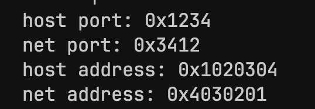
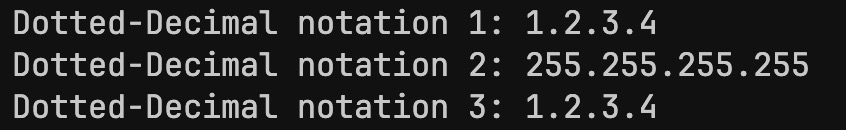

# C-Socket-Programming Lab 3


## Representing Internet Addresses (Intenet Address + Port Number)


---

### 1. Internet (Logical) Address


#### Definition
An Internet Protocol (IP) Address is a numerical label assigned to each device connected to a computer network that uses the Internet Protocol for communication.

It is analagous to a person's phone number used for communicating with that person.

Example: `237.84.2.178` (IPv4 address)

Each section delimited by a `.` is called an <em>octet</em>, which is a number between 0 and 255. Each octet is of one byte in size.


#### Format
`<octet>.<octet>.<octet>.<octet>`


#### Composition

Each IP address can be split into a network ID and a host ID. 

The network ID is called the <em>prefix</em>, specifying an area of the network where a device resides. The host ID is called the <em>suffix</em>, which labels a specific device inside that network.

Example: `237.84` is the network ID and `2.178` is the host ID.

The exact split depends on the class of IP address (Class A, Class B, or Class C).


#### Classful v/s Classless IP addresses

A subnet is a group of IP addresses that share a common prefix.
A subnet mask is an **AND** mask used to determine the host ID of an IP address.

| Classful IP Class | Range | Default Subnet Mask | # of Networks | # of Hosts per Network |
| --- | --- | --- | --- | --- |
| A | 1 - 126 | 255.0.0.0 | 128 | 16,777,214 |
| B | 128 - 191 | 255.255.0.0 | 16,384 | 65,534 |
| C | 192 - 233 | 255.255.255.0 | 2,097,152 | 254 |

In classless addressing, uses the **CIDR** (Classless Inter-Domain Routing) notation.

Example: `237.84.2.178/24` is a subnet with a prefix length of 24.

The advantage to classless over classfull addressing is that the prefix length is not fixed by classes, rather the allocation of the network ID is determined by the prefix length.

---

### 2. Port Number


#### Definition

A port number is the logical address of the **process** that uses a network to communicate, which uniquely identifies a network-based process on a computer.

A connection between two processes must use the **same** port number.

---

### IP address representation in C

In C, we use the `struct sockaddr_in` structure to represent an IP address.

This struct is used to store the IP address and port number of a socket.
```c
struct sockaddr_in 
{
    sa_family_t sin_family;
    uint16_t sin_port;
    struct in_addr sin_addr;
    char sin_zero[8];   // no special meaning, not used (zero padding)
};  // IP address + port
```

```c
struct sockaddr
{
    sa_family_t sa_family;
    char sa_data[14];
};  // IP address only  
```


`sa_family` is the type of the socket address family (almost always `AF_INET`).

`sin_port` is the socket port number.

`sin_addr` is the socket IP address (IPv4).

<br>

#### Populating the `sockaddr_in` struct

```c
struct sockaddr_in serv_addr;
char *serv_port = "8080";

// zero out the memory block
memset(&serv_addr, 0, sizeof(serv_addr));

// populate the struct
serv_addr.sin_family = AF_INET;
serv_addr.sin_port = htons(atoi(serv_port));
serv_addr.sin_addr.s_addr = htonl(INADDR_ANY);
```

Here, `INADDR_ANY` represents **any IP address**. It is mainly used for listening to all incoming connections.

<br>


#### Binding the Socket

When binding a socket to an IP address and port number, we **cast** the `sockaddr_in` struct to a `sockaddr` struct.

```c
struct sockaddr_in serv_addr;
...

if bind(serv_sock, (struct sockaddr *) &serv_addr, sizeof(serv_addr)) == -1)
    error_handling("bind() error!");
...
```

<br>


#### Converting between host and network byte order

Because of different endianness across platforms, we can use the `htonl()` and `htons()`, `ntohs()`, and `ntohl()` functions to convert IP addresses (long) and port numbers (short) from network byte order (big endian) to host byte order (little endian), and viceversa.

```c
int main(int argc, char *argv[])
{
    unsigned short host_port = 0x1234;
    unsigned short net_port = htons(host_port);

    unsigned long host_address = 0x01020304;
    unsigned long net_address = htonl(host_address);

    printf("host port: 0x%x\n", host_port);
    printf("net port: 0x%x\n", net_port);

    printf("host address: 0x%x\n", host_address);
    printf("net address: 0x%x\n", net_address);

    return 0;
}
```

##### Output:



`struct sockaddr_in` always stores IP addresses in network order (big-endian), so there is a need to convert them to host order.


<br>

#### Converting between network format and human-readable format

`inet_aton()` and `inet_ntoa()` are used to convert between network and human-readable formats.

```c
struct sockaddr_in addr1, addr2;
char *str_ptr;
char str_arr[20];

addr1.sin_addr.s_addr = htonl(0x1020304);
addr2.sin_addr.s_addr = htonl(0xffffffff);

str_ptr = inet_ntoa(addr1.sin_addr);
strcpy(str_arr, str_ptr);
printf("Dotted-Decimal notation 1: %s \n", str_ptr);

inet_ntoa(addr2.sin_addr);
printf("Dotted-Decimal notation 2: %s \n", str_ptr);
printf("Dotted-Decimal notation 3: %s \n", str_arr);

```

##### Output:



<br>

Similarly for `aton()`:

```c
char *addr = "127.232.124.79";
struct sockaddr_in addr_inet;

if (!inet_aton(addr, &addr_inet.sin_addr))
    error_handling("Conversion error");
else
    printf("Network ordered integer address: %#x \n", addr_inet.sin_addr.s_addr);
```

##### Output:


