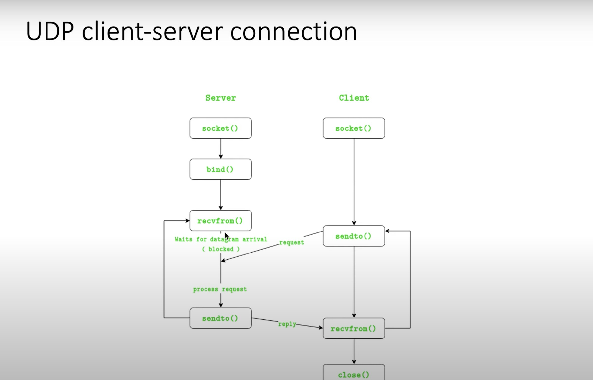
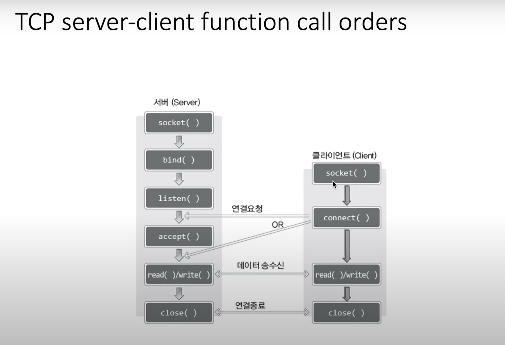
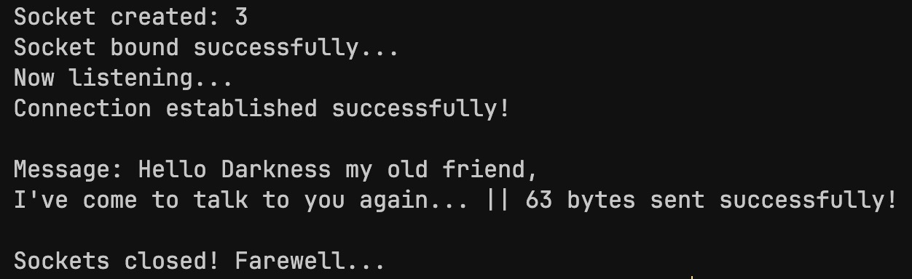
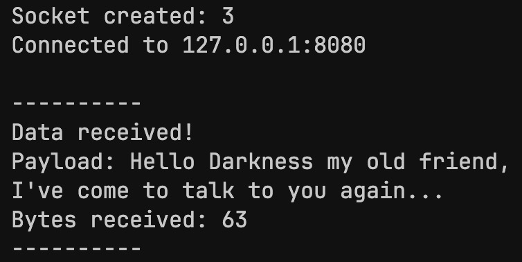

# C-Socket-Programming Lab 4

## TCP/IP Stack, Basic TCP Client-Server Implementation

---

### TCP/IP Stack (TCP *over* IP)

It is a protocol stack consisting of the Transmission Control Protocol (TCP) and the Internet Protocol (IP), which work in tandem to provide a reliable, secure, and efficient way to transfer data over the internet.


#### Composition

The TCP/IP stack consists of **5** layers:

* Application: supports network applications (ftp, smtp, http, ssh, e.t.c)
* Transport: data transmission between end systems (**TCP**, **UDP** [User Datagram Protocol], e.t.c)
* Network: defines protocols and implementations for the logical transmission of data through networks (**IP**, ICMP [Internet Control Message Protocol], e.t.c)
* Data Link: data transmission between two neighbors in the network (Ethernet, e.t.c)
* Physical: transmits raw bits and provides services to the data-link layer.

<br>


### TCP v/s UDP

- TCP sockets are referred to as "connection-oriented" sockets.
- UDP sockets are generally connectionless.
- The TCP protocol guarantees complete transmission of data, while UPD keeps sending data packets without acknowledgement.

Unlike TCP, UDP does not require `listen()` and `connect()`, by the nature of the protocol.

<br>

#### UDP Client-Server Connection:

##### UDP Server:
1. Create UDP socket.
2. Bind socket to server address.
3. Wait until a datagram packet arrives from client.
4. Process the datagram and send a reply to the client.
5. Loop from Step 3.


##### UDP Client:
1. Create UDP socket.
2. Send message to server.
3. Wait until response from server is received.
4. Process reply and go back to Step 2, if necessary.
5. Close socket descriptor and exit.

<br>



---

### Recap: TCP Server's function call order:

1. `socket()`
2. `bind()`
3. `listen()`
4. `accept()`
5. `read() / write()`
6. `close()`


### TCP Client's function call order:

1. `socket()`
2. `connect()`
3. `read() / write()`
4. `close()`

<br>



<br>

The client's function call order is slightly simpler then the server's, since it doesn't need to cater to connection request backlogs and only connects to one server.

For a successful connection, the server socket needs to be in the listening state (`listen()`), and the client socket needs to be in the connected state (`connect()`) with the correct IP address and port number.

>Note: The **UDP** protocol uses `recvfrom()` and `sendto()` to send and receive data packets, as there is no persistent connection between the client and the server as in the **TCP** protocol, and hence the endpoints must be privy to source information with each meesage / packet received.


---

### TCP Server - an iterative approach:

A TCP server supports a single client at a time, and accepts the next client in the backlog after terminating the existing connection.

To handle multiple clients at the same time, the TCP server can create **threads**, one for each client, reading and writing data to each client's respective thread.

> Note: `read()` and `write()` overcome potential issues caused by network delays, by blocking system calls until data is available in the respective buffers, or until a timeout occurs.


<br>


#### Example: Simple Echo program

##### Server-side code:

```c
for (i = 0; i < MAX_CLIENTS; i++)
{
    // accept next connection request in backlog
    client_socket = accept(server_socket, (struct sock_addr*) &client_addr, &client_addr_size);

    // error handling
    if (client_socket == -1)
        error_handling("accept() error");

    else
        printf("Connected to client # %d", i + 1);

    // read data sent by client until no further data is received
    while ((str_len = read(client_socket, message, BUF_SIZE)) != 0)
        // echo data to client
        write(client_socket, message, str_len);

    // terminate connection
    close(client_socket);
}
```


##### Client-side code:

```c
while (1)
{
    fputs("Input data (Q/q to quit): ", stdout);
    fgets(message, BUF_SIZE, stdin);

    // accept user input until 'q' or 'Q' is entered
    if (!str_cmp(message, "q\n") || !str_cmp(message, "Q\n"))
        break;

    // send user input to server
    write(socket, message, strlen(message));

    // receive echoed data from server
    str_len = read(socket, message, BUF_SIZE - 1);

    // null terminate received data
    message[str_len] = '\0';

    printf("Message from server: %s", message);
}
```

> Note: `read()` and `write()` are more general I/O functions. A more common approach is to use `recv()` and `send()` which exclusively work for sockets. The main difference between them is that the latter contain an additional argument for *flags*.
>

---

### Basic TCP Client-Server Implementation

<br>

#### tcp_server.c

```c
#include <stdio.h>
#include <string.h>
#include <stdlib.h>
#include <unistd.h>
#include <arpa/inet.h>

int main(int argc, char *argv[])
{
    // socket file descriptors
    int serverSocketFD, clientSocketFD;

    // addresses
    struct sockaddr_in serverAddress, clientAddress;

    // size of addresses
    socklen_t serverAddressSize, clientAddressSize;

    char* message = "Hello Darkness my old friend,\nI've come to talk to you again...\0";

    // socket creation (IPv4 TCP socket)
    serverSocketFD = socket(AF_INET, SOCK_STREAM, 0);

    // socket validation
    if (serverSocketFD == -1)
    {
        printf("Error: Socket could not be created...\n");
        exit(1);
    }

    else
        printf("Socket created: %d\n", serverSocketFD);


    // zero out server address block
    memset(&serverAddress, 0, sizeof(serverAddress));
    
    // zero out client address block
    memset(&clientAddress, 0, sizeof(clientAddress));

    // populate serverAddress
    serverAddress.sin_family = AF_INET;
    serverAddress.sin_port = htons(8080);
    serverAddress.sin_addr.s_addr = htonl(INADDR_ANY); // set to listen for incoming connections on all network interfaces

    // bind serverAddress to server socket
    if (bind(serverSocketFD, (struct sockaddr *) &serverAddress, sizeof(serverAddress)) != 0)
    {
        printf("Error: failed to bind socket...\n");
        exit(1);
    }

    else
        printf("Socket bound successfully...\n");

    // listen for incoming connections (1 in queue)
    if (listen(serverSocketFD, 1) != 0)
    {
        printf("Error: failed to listen...\n");
        exit(1);
    }

    else
        printf("Now listening...\n");


    // accept incoming connection request
    clientSocketFD = accept(serverSocketFD, (struct sockaddr *) &clientAddress, &clientAddressSize);

    if (clientSocketFD == -1)
    {
        printf("Error: failed to accept incoming request...\n");
        exit(1);
    }

    else
        printf("Connection established successfully!\n");

    
    // write message to client
    int bytesWritten = write(clientSocketFD, message, strlen(message));
    printf("\nMessage: %s || %d bytes sent successfully!\n", message, bytesWritten);

    // close sockets
    close(clientSocketFD);
    close(serverSocketFD);

    printf("\nSockets closed! Farewell...\n");

    return 0;
}
```
<br>

#### tcp_client.c

```c
#include <stdio.h>
#include <string.h>
#include <stdlib.h>
#include <unistd.h>
#include <arpa/inet.h>

#define BUFFER_SIZE 128

int main(int argc, char *argv[])
{
    // socket file descriptors
    int socketFD;
    struct sockaddr_in serverAddress;

    // socket creation (IPv4 TCP socket)
    socketFD = socket(AF_INET, SOCK_STREAM, 0);

    // data buffer (loading area for data)
    char buffer[BUFFER_SIZE];

    // socket validation
    if (socketFD == -1)
    {
        printf("Error: Socket could not be created...\n");
        exit(1);
    }

    else
        printf("Socket created: %d\n", socketFD);

    
    // zero out server address block
    memset(&serverAddress, 0, sizeof(serverAddress));

    // populate serverAddress
    serverAddress.sin_family = AF_INET;
    serverAddress.sin_port = htons(8080);
    serverAddress.sin_addr.s_addr = inet_addr("127.0.0.1"); // localhost; 
    // DEPRECATED: inet_addr converts a dots-and numbers address to in_addr (converts to "n"etwork)

    // connect to server
    if(connect(socketFD, (struct sockaddr *)&serverAddress, sizeof(serverAddress)) != 0)
    {
        printf("Error: failed to conect...\n");
        exit(1);
    }

    else
        printf("Connected to 127.0.0.1:8080\n");

    
    // read data from server
    int bytesRead = read(socketFD, buffer, BUFFER_SIZE);

    printf("\n----------\nData received!\nPayload: %s\nBytes received: %d\n----------\n", buffer, bytesRead);

    // close connection
    close(socketFD);

    return 0;
}
```

#### Server output:




#### Client output:

