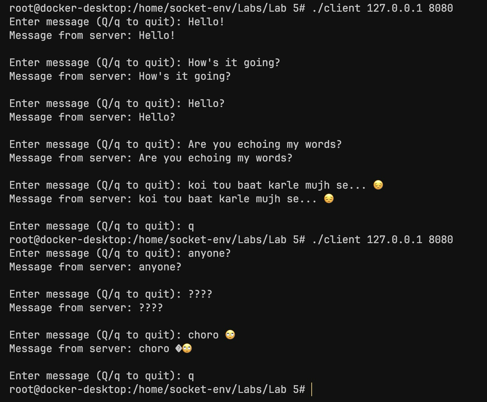
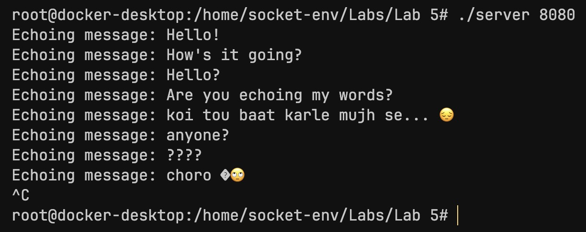

# C-Socket-Programming Lab 5

## Understanding UDP Sockets

---

### Characteristics of UDP Sockets:

- UDP is part of the TCP / IP protocol family, located at the Transport layer.
- UDP sockets are **connectionless** ("best-effort"); no handshake, packet sequence, acknowledgement or flag fields in data packets.
- Since UDP sockets are connectionless, a **single** socket is used to communicate with multiple hosts, rather than connecting to each host individually (TCP).
- The data being transmitteed is sent as a single packet, unlike TCP's segmentation.
- UDP sockets detect errors but do not attempt to correct them.
- They do not support congestion control.

> **Note:** A UDP socket **can** be connected to a server's address, but it would still be transmitting datagrams. This could be useful when a program needs to take advantage of UDP's lightweight and low-latency protocol, and simplify data transmission with a specific peer.

<br>


### Sending and Receiving Data in UDP:

Since UDP is connectionless and does not require a handshake to transmit packets, the server will **not** have any information about a client until one sends a packet directly to the server.

The server will then respond (if necessary) based on the information in the received packet.


#### 1. Sending Data:

```c
ssize_t sendto(int sock, const void *buf, size_t len, int flags, const struct sockaddr *to, socklen_t addrlen);
```

Because UDP sockets do not connect to a particular host, the destination address must be specified in `sendto()`, unlike TCP's `send()` / `write()`.


#### 2. Receiving Data:

```c
ssize_t recvfrom(int sock, void *buf, size_t len, int flags, struct sockaddr *src_addr, socklen_t *addrlen);
```

One socket can receive data from multiple hosts, the source address must be loaded into the function.

> **Note**: `sendto()` uses `addrlen` by value since the length of the destination address is fixed and known, however, `recvfrom()` uses `addrlen` by reference.
> In `recvfrom()`, `src_addr` contains the address of the host from which the data will come from, and will fill `addr_len` with the actual size of `src_addr` when it returns.


---

### Simple UDP Echo program:

#### udp_echo_server.c

```c
#include <stdio.h>
#include <string.h>
#include <stdlib.h>
#include <unistd.h>
#include <arpa/inet.h>

#define BUFFER_SIZE 1024

int main(int argc, char *argv[])
{
    // only one socket is required
    int socketFD;
    char message[BUFFER_SIZE];
    int bytesReceived;
    struct sockaddr_in serverAddress, clientAddress;
    socklen_t clientAddressSize;

    if (argc != 2)
    {
        printf("Usage: %s <port>\n", argv[0]);
        exit(1);
    }

    // socket creation
    socketFD = socket(AF_INET, SOCK_DGRAM, 0);

    if (socketFD == -1)
    {
        printf("Error: failed to create socket...\n");
        exit(1);
    }

    // zero out addresses
    memset(&serverAddress, 0, sizeof(serverAddress));
    memset(&clientAddress, 0, sizeof(clientAddress));

    // populate serverAddress
    serverAddress.sin_addr.s_addr = htonl(INADDR_ANY);
    serverAddress.sin_family = AF_INET;
    serverAddress.sin_port = htons(atoi(argv[1]));

    // bind socket
    if (bind(socketFD, (struct sockaddr *)&serverAddress, sizeof(serverAddress)) == -1)
    {
        printf("Error: failed to bind...\n");
        exit(1);
    }


    // no need to start listening
    while (1)
    {
        clientAddressSize = sizeof(clientAddress);
        int bytesReceived = recvfrom(socketFD, message, BUFFER_SIZE, 0, (struct sockaddr *)&clientAddress, &clientAddressSize);
        
        message[bytesReceived] = 0;
        printf("Echoing message: %s", message);

        // echo...
        sendto(socketFD, message, bytesReceived, 0, (struct sockaddr *)&clientAddress, clientAddressSize);
    }

    close(socketFD);

    return 0;
}
```
<br>

#### udp_echo_client.c

```c
#include <stdio.h>
#include <string.h>
#include <stdlib.h>
#include <unistd.h>
#include <arpa/inet.h>

#define BUFFER_SIZE 1024

int main(int argc, char *argv[])
{
    // only one socket is required
    int socketFD;
    char message[BUFFER_SIZE];
    int bytesReceived;
    struct sockaddr_in serverAddress, recvAddress;
    socklen_t addressSize;

    if (argc != 3)
    {
        printf("Usage: %s <IP> <port>\n", argv[0]);
        exit(1);
    }

    socketFD = socket(AF_INET, SOCK_DGRAM, 0);

    if (socketFD == -1)
    {
        printf("Error: failed to create socket...\n");
        exit(1);
    }

    memset(&serverAddress, 0, sizeof(serverAddress));
    memset(&recvAddress, 0, sizeof(recvAddress));

    serverAddress.sin_addr.s_addr = inet_addr(argv[1]);
    serverAddress.sin_family = AF_INET;
    serverAddress.sin_port = htons(atoi(argv[2]));

    while(1)
    {
        fputs("Enter message (Q/q to quit): ", stdout);
        fgets(message, sizeof(message), stdin);

        if (!strcmp(message, "Q\n") || !strcmp(message, "q\n"))
            break;

        sendto(socketFD, message, strlen(message), 0, (struct sockaddr *)&serverAddress, sizeof(serverAddress));

        // reevaluate before every recvfrom()
        addressSize = sizeof(recvAddress);
        bytesReceived = recvfrom(socketFD, message, BUFFER_SIZE, 0, (struct sockaddr *)&recvAddress, &addressSize);

        message[bytesReceived] = 0;
        printf("Message from server: %s\n", message);
    }

    close(socketFD);
    return 0;
}
```
<br>

The program is similar to implementation using TCP, the main differences being the lack of client connection requests , and the use of `recvfrom()` and `sendto()`.

Since multiple clients can ping the server without a dedicated connection, the source address must be loaded into the `struct sockaddtr_in` when `recvfrom()` is called to receive the message.

<br>

#### Client Output:



#### Server Output:


In the above example, the client "quits" and exits the program, then reappears as another client and sends datagrams to the server.

The server is on an infinite loop and it will echo data from any client that sends a datagram to it, and will stay up until it is forcefully closed (CTRL+C).
