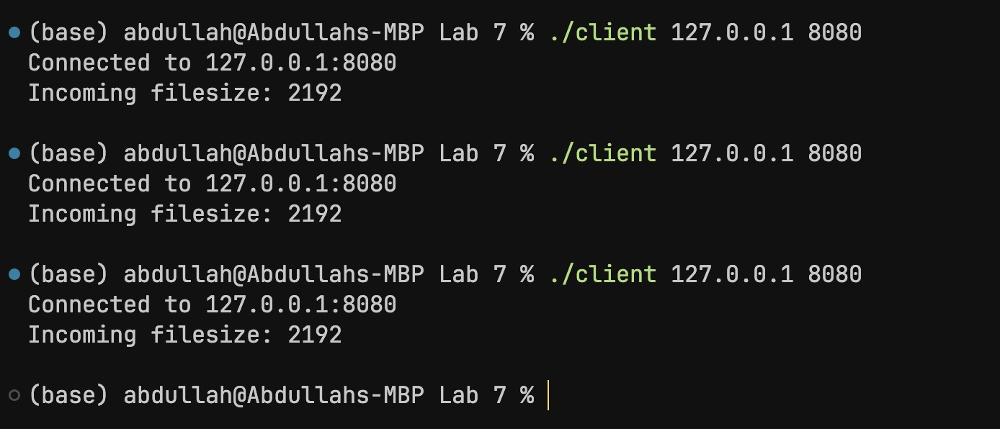
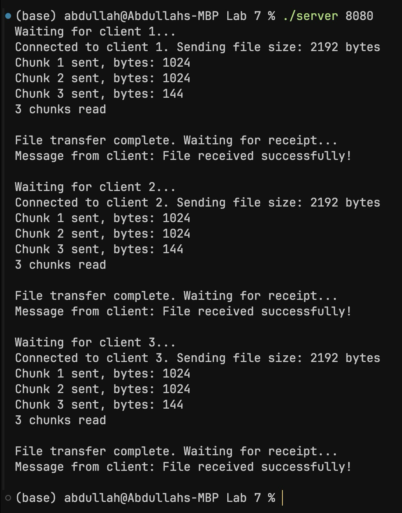

# C-Socket Programming Lab 7 (no Lab 6)

## Half-Closed TCP Connections, Basic File Server Implementation

---

### Recap: close()

`close()` completely terminates the connection on both endpoints. 

This may cause issues if the server / client has not finished data transmission (e.g. there is data left in the buffers not yet read by an endpoint).


### Solution: TCP half-close using shutdown()

A "half-close" provides the ability for one end of the connection to terminate its output **(WRITE stream)**, while still being able to receive data from the other end **(READ stream)**, effectively cutting off communication in one direction.

```c
int shutdown(int sockfd, int how);
```

The `how` argument specifies the stream which should be shut down.

`how` can be one of the following:

- `SHUT_RD`: shutdown the read stream
- `SHUT_WR`: shutdown the write stream
- `SHUT_RDWR`: shutdown both streams

<br>

#### Example:

```c
int bytesReceived = recv(socketFD, message, BUFFER_SIZE, 0);

// shutdown read
if (shutdown(socketFD, SHUT_RD) == -1)
    error_handling("shutdown() error!");

// write only
send(socketFD, message, bytesReceived, 0);

// close
close(socketFD);
```

---

### Basic File Server 

A program which sends the contents of a file to a client (byte streams).

To read and send the correct number of bytes, we need to use `send()` and `recv()` in a loop, while keeping track of number of bytes read.

File chunks are sent in the same loop, and the loop ends when the file is fully sent to the client.

An HTML server works on a similar principle.


#### file_server.c

```c
#include <stdlib.h>
#include <stdio.h>
#include <unistd.h>
#include <arpa/inet.h>
#include <string.h>

#define BUFFER_SIZE 1024
#define QUEUE 3

int main(int argc, char *argv[])
{
    int serverSocketFD, clientSocketFD;
    long bytesReceived = 0;
    long bytesRead = 0, bytesWritten = 0;
    int chunkCount = 0;

    struct sockaddr_in clientAddress, serverAddress;
    socklen_t clientAddressSize;

    char buffer[BUFFER_SIZE];

    if (argc != 2)
    {
        printf("Usage: %s <port>\n", argv[0]);
        exit(1);
    }

    // Socket creation
    serverSocketFD = socket(PF_INET, SOCK_STREAM, 0);
    if (serverSocketFD == -1)
    {
        perror("Error: failed to create server socket");
        exit(1);
    }

    memset(&clientAddress, 0, sizeof(clientAddress));
    memset(&serverAddress, 0, sizeof(serverAddress));

    serverAddress.sin_addr.s_addr = htonl(INADDR_ANY);
    serverAddress.sin_family = AF_INET;
    serverAddress.sin_port = htons(atoi(argv[1]));

    if (bind(serverSocketFD, (struct sockaddr *)&serverAddress, sizeof(serverAddress)) == -1)
    {
        perror("Error: failed to bind");
        exit(1);
    }

    if (listen(serverSocketFD, QUEUE) == -1)
    {
        perror("Error: failed to listen");
        exit(1);
    }

    // Open file
    FILE *file = fopen("speech.txt", "r");
    if (file == NULL)
    {
        perror("Error: could not open file");
        exit(1);
    }

    // Get file size
    fseek(file, 0, SEEK_END);
    long fileSize = ftell(file);
    rewind(file);

    clientAddressSize = sizeof(clientAddress);

    for (int i = 0; i < QUEUE; i++)
    {
        printf("Waiting for client %d...\n", i + 1);

        clientSocketFD = accept(serverSocketFD, (struct sockaddr *)&clientAddress, &clientAddressSize);
        if (clientSocketFD == -1)
        {
            perror("Error: failed to connect");
            exit(1);
        }

        printf("Connected to client %d. Sending file size: %ld bytes\n", i + 1, fileSize);

        // Send file size
        write(clientSocketFD, &fileSize, sizeof(fileSize));

        // Reset file pointer to the beginning
        rewind(file);

        // Read and send file chunks
        while ((bytesRead = fread(buffer, 1, BUFFER_SIZE, file)) > 0)
        {
            chunkCount++;
            long totalWritten = 0;

            while (totalWritten < bytesRead)
            {
                bytesWritten = write(clientSocketFD, buffer + totalWritten, bytesRead - totalWritten);
                if (bytesWritten < 0)
                {
                    perror("Error: failed to write to socket");
                    exit(1);
                }
                totalWritten += bytesWritten;
            }
            printf("Chunk %d sent, bytes: %ld\n", chunkCount, bytesRead);
        }

        printf("%d chunks read\n\n", chunkCount);
        chunkCount = 0;

        // Close input buffer
        shutdown(clientSocketFD, SHUT_WR);
        printf("File transfer complete. Waiting for receipt...\n");

        // Read receipt
        bytesReceived = read(clientSocketFD, buffer, BUFFER_SIZE);
        if (bytesReceived > 0)
        {
            buffer[bytesReceived] = 0; // Null-terminate
            printf("Message from client: %s\n", buffer);
        }
        else if (bytesReceived == 0)
        {
            printf("Client closed connection without sending receipt.\n");
        }
        else
        {
            perror("Error reading receipt from client");
        }

        close(clientSocketFD);
    }

    fclose(file);
    close(serverSocketFD);

    return 0;
}
```


#### file_client.c

```c
#include <stdlib.h>
#include <stdio.h>
#include <unistd.h>
#include <arpa/inet.h>
#include <string.h>

#define BUFFER_SIZE 256
#define QUEUE 3

int main(int argc, char *argv[])
{
    int socketFD;
    long bytesReceived = 0;
    long fileSize = 0;

    struct sockaddr_in serverAddress;

    char buffer[BUFFER_SIZE];

    if (argc != 3)
    {
        printf("Usage: %s <IP> <port>\n", argv[0]);
        exit(1);
    }

    socketFD = socket(AF_INET, SOCK_STREAM, 0);

    memset(&serverAddress, 0, sizeof(serverAddress));

    serverAddress.sin_addr.s_addr = inet_addr(argv[1]);
    serverAddress.sin_family = AF_INET;
    serverAddress.sin_port = htons(atoi(argv[2]));

    if (connect(socketFD, (struct sockaddr *)&serverAddress, sizeof(serverAddress)) == -1)
    {
        printf("Error: could not connect to server...\n");
        exit(1);
    }

    else
    {
        printf("Connected to %s:%s\n", argv[1], argv[2]);
    }

    // create destination file
    FILE *file = fopen("received.txt", "w");

    // get filesize
    read(socketFD, &fileSize, sizeof(fileSize));

    printf("Incoming filesize: %ld\n\n", fileSize);

    long totalReceived = 0;

    while (totalReceived < fileSize)
    {
        bytesReceived = read(socketFD, (void *)buffer, BUFFER_SIZE);

        // write bytes to file
        fwrite(buffer, 1, bytesReceived, file);

        totalReceived += bytesReceived;
    }

    if (totalReceived == fileSize)
    {
        write(socketFD, "File received successfully!\n", 29);
    }
    else
    {
        write(socketFD, "File transfer incomplete!\n", 27);
    }

    fclose(file);
    close(socketFD);

    return 0;
}
```

<br>

#### Client Output



#### Server Output



> The buffer size can be altered to read larger or smaller chunks of data from the file. This may prove useful under memory constraints.